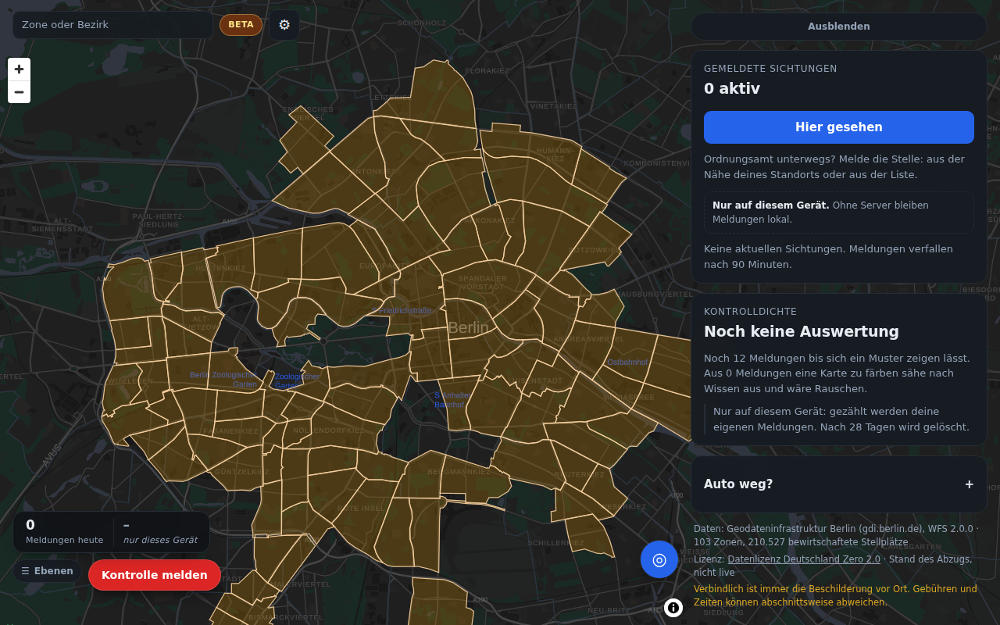
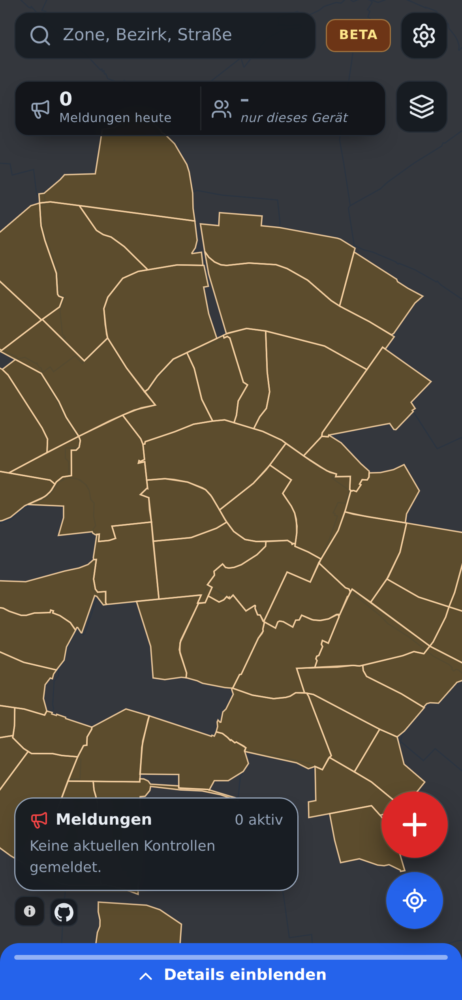
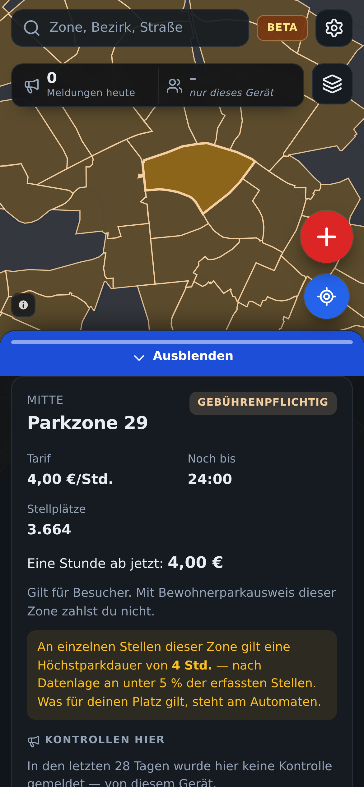
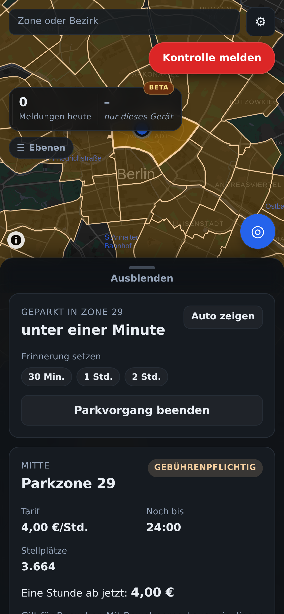

# knoellchenfrei


Wo stehe ich, kostet Parken hier gerade etwas, wie viel, wie lange darf ich
stehen — und wo wurde zuletzt das Ordnungsamt gesehen.

Eine PWA auf den amtlichen Geodaten der Städte. **Berlin, Hamburg, Frankfurt am
Main und München**, umschaltbar in den Einstellungen — eine Stadt zur Zeit,
die Daten der anderen werden erst beim Wechsel geladen. Läuft im Browser, auf dem Homescreen
installierbar, ohne Server.



## Was sie kann

| | |
| --- | --- |
| **Zone finden** | Standort oder Tippen auf die Karte. 103 Zonen in Berlin, 145 Bewohnerparkgebiete in Hamburg, 27 Bewohnerparkbereiche in Frankfurt, 82 Parkraummanagementgebiete in München. Farbe trägt eine Aussage: Orange füllt, wenn kassiert wird, gebührenfreie Zonen bleiben als leise Kontur stehen — sonst wäre an einem Sonntag ganz Berlin eingefärbt und die eine Fläche, auf die es ankommt, ginge unter. |
| **Kosten** | Tarif, Geltungszeiten, „noch bis" / „frei bis". Berücksichtigt Feiertage und Sommerzeit — je Bundesland, nicht pauschal. Kein Betrag ist nicht null Euro: Hamburgs Parkscheibengebiete kosten nichts und verlangen trotzdem etwas, und die App sagt das statt „0,00 €". In München nennt die Quelle für **kein** Gebiet einen Betrag; dort steht „Tarif nicht angegeben" statt einer Zahl. |
| **Stadt wechseln** | In den Einstellungen, nach FreiFahrens Vorbild — und auf Vorschlag: Liegt der abgerufene Standort in einer anderen der vier Städte, bietet die App den Wechsel an, ohne dafür eine zweite Berechtigung zu verlangen. Die Wahl liegt im Browser, nicht im Build; ein unbekannter Stadtschlüssel fällt **nicht** still auf Berlin zurück, sondern bricht ab. |
| **Parkuhr** | Auto-Position merken, Laufzeit, Erinnerung. Marker verschiebbar. Übersteht Neuladen. |
| **Umfeld** | 385 Ladepunkte, 83 Carsharing-Plätze, 108 P+R-Anlagen, 923 Behindertenparkplätze, Umweltzone — **in Berlin**. München bedient als einzige weitere Stadt alle vier Arten (369 Ladeorte, 710 Carsharing-Plätze, 25 P+R-Anlagen, 556 Behindertenparkplätze) und liefert die Umweltzone als 12 Flächen; Frankfurt nur die 458 Behindertenparkplätze, Hamburg keine dieser Ebenen. Die App blendet aus, was eine Stadt nicht hat, statt eine leere Karte als Ergebnis auszugeben. |
| **Ordnungsamt** | Melde-Sheet mit Ortswahl (angetippt, Standort, in der Nähe, Suche), Bestätigung durch andere, Sterne-Bewertung, Verfall nach 90 Minuten. |
| **Live-Zahlen** | Wie viele die App gerade offen haben, wie viele heute, wie viele Meldungen aktiv sind. Nur was zählbar ist — sonst gar nichts. |
| **Kontrolldichte** | Heatmap der letzten 28 Tage plus Report: letzte 24 h, Histogramm über 28 Tage, Stundenprofil des Wochentags, häufigste Zonen. Aus anonymen `{Tag, Stunde, 250-m-Feld}`-Strichlisten. Zeigt nichts, solange zu wenige Meldungen da sind. |
| **Einstellungen** | Ein Sheet mit stehendem Hinweis, sieben häufigen Fragen zu genau den Stellen, an denen die Anzeige überrascht, Mitmachen-Wegen und den rechtlichen Links. |
| **Ruhetag erklärt** | Wenn auffällig wenige Zonen kassieren, sagt die App warum — Wochentage und Stunden aus den Daten abgeleitet, nicht fest verdrahtet. Wegklickbar. |
| **Standort** | Erklärt sich, bevor der Browser fragt — „Später" löst den nativen Dialog gar nicht erst aus, die Berechtigung bleibt also abrufbar. |
| **Feedback** | Idee, Fehler oder Sonstiges als Freitext. Kein Kontaktfeld, keine Antwort — dafür auch keine gespeicherte Adresse. Nur der Betreiber liest, deshalb nur mit eigenem Server. |
| **Offline** | Service Worker, Daten eingefroren. Funktioniert in der Tiefgarage. |
| **Als App ablegen** | Manifest mit eigenem und zuschnittsicherem Symbol, Bildern für die Installations-Karte und drei Verknüpfungen im Symbol-Menü (Melden, Standort, Kontrollen). Der Hinweis kommt erst ab dem zweiten Besuch und nie wieder, wenn er weggeklickt wurde; auf iOS steht der Weg übers Teilen-Menü. |
| **Geschlossene Beta** | Bis der Trägerverein eingetragen ist: `noindex` und eine sperrende `robots.txt`, eine Beta-Pille in der Kopfzeile und ein Absatz in den Einstellungen. Hängt an einem Schalter, nicht an einem Gedächtnis — `PUBLIC_LAUNCH=1 pnpm build` hebt beides auf. |
| **Telegram** | Ein Bot am selben Worker: Standort schicken, Meldung steht auf der Karte. Kein zweiter Dienst, dieselbe Datenbank, dieselbe Meldegrenze. Die Nutzerkennung wird gehasht wie eine IP-Adresse, die Chat-Kennung gar nicht gespeichert. |
| **Updates** | Eine neue Version übernimmt nicht selbst — sie meldet sich in der Kopfzeile und wartet. Ein Wechsel mitten im Melden würde Eingaben verlieren. |

<p align="center">
  
  
  
</p>

## Herkunft

Das Projekt begann 2012 als Java/Spring-Anwendung. Sie ist beim Umzug am
6. September 2026 im alten Repository geblieben — die Domäne ist dieselbe, der
Code teilt keine Zeile. Von 2,8 MB waren nur 256 KB eigener Quelltext, der Rest
Bezirksgrenzen in doppelter Ausfertigung, einkopierte Fremdbibliotheken und eine
Excel-Add-in-Datei mit Makros.

Was den Neubau nötig machte: Die Zonendaten von damals waren von Hand in
ScribbleMaps gezeichnet (der Commit heißt wörtlich `ParkZonen invented`), und
Koordinaten waren durchgängig lat/lon vertauscht — zweimal, sodass es sich
aufhob. Die Ideenliste von 2012 ist dagegen gut gealtert und war die Vorlage für
den Funktionsumfang — sie zieht als kommentiertes Dokument mit um:
[docs/ideen-2012.md](docs/ideen-2012.md).

## Daten

Vier Länder, sechs Dienste, zwei Lizenzen — und der Unterschied ist keine
Formalie:

| | Quelle | Lizenz | Bestand |
| --- | --- | --- | --- |
| **Berlin** | [GDI Berlin](https://gdi.berlin.de), WFS 2.0.0 | [DL-DE/Zero 2.0](https://www.govdata.de/dl-de/zero-2-0) — Namensnennung *optional* | 103 Zonen, 45.917 Abschnitte, **210.527 bewirtschaftete Stellplätze**, 1.499 Orte, 97 Ortsteile |
| **Hamburg** | [LGV Hamburg](https://geodienste.hamburg.de), WFS 2.0.0 | [DL-DE/Namensnennung 2.0](https://www.govdata.de/dl-de/by-2-0) — Namensnennung ist **Lizenzbedingung** | 145 aktive Bewohnerparkgebiete, 104 Stadtteile |
| **Frankfurt am Main** | [Stadt Frankfurt](https://geowebdienste.frankfurt.de/Parken), WFS 2.0.0 | [DL-DE/Namensnennung 2.0](https://www.govdata.de/dl-de/by-2-0) — Quellenvermerk wörtlich `Stadt Frankfurt am Main, www.frankfurt.de` | 27 von 42 Bewohnerparkbereichen, 921 Parkscheinautomaten als Sachdatenquelle, 458 Behindertenparkplätze, 46 Stadtteile |
| **München** | [Landeshauptstadt München](https://geoportal.muenchen.de/geoserver/mor_wfs/ows), WFS 2.0.0 | [DL-DE/Namensnennung 2.0](https://www.govdata.de/dl-de/by-2-0) — Quellenvermerk wörtlich `Datenquelle: dl-de/by-2-0: Landeshauptstadt München – opendata.muenchen.de`, je Ebene aus dem ISO-Metadatensatz belegt | 82 Parkraummanagementgebiete, 13.714 Straßenseiten als Sachdatenquelle, **95.903 Stellplätze**, 1.660 Orte, Umweltzone, 25 Stadtbezirke |

Deshalb trägt `City.attribution` ein `attributionRequired`-Flag bis in die
Oberfläche: Eine Hamburg-, Frankfurt- oder München-Ansicht ohne Quellenangabe
verletzt die Lizenz, eine Berlin-Ansicht ohne sie nicht.

Vollständige Liste mit Endpunkten, Lizenzen und geprüften Negativbefunden:
[docs/data-sources.md](docs/data-sources.md).

Daten werden zur Buildzeit eingefroren, nicht zur Laufzeit aus dem WFS geladen:
Berlins Segment-Layer ist ~49 MB, ein Snapshot macht die App offlinefähig, und
Zonendaten ändern sich über Monate — ein täglicher Rebuild ist frischer als die
Quelle sich bewegt. CORS wäre kein Hinderungsgrund, `gdi.berlin.de` sendet
`Access-Control-Allow-Origin: *`. Die eingefrorenen Dateien liegen je Stadt
unter `public/data/<stadt>/` und werden vom Browser geholt — ein Stadtwechsel
braucht deshalb keinen zweiten Build.

## Was an den Daten schwierig ist

Zeiten und Gebühren kommen als **Freitext**. Allein in den beiden Berliner
Feeds sind es 28 Schreibweisen für rund zehn tatsächliche Fahrpläne:

```
Mo-Fr 9-20 Uhr / Sa 9-18 Uhr      Mo-Sa, 9-22 Uhr
Mo-Sa / 9-20 Uhr                  Mo-Fr 09:00-20:00 Uhr, Sa 09:00-18:00 Uhr
Mo-Sa 9-22 UhrMo-Sa 9-22 Uhr      Mo-Fr 9-17 Uhr, Sa 9 -14 Uhr/ Advents-Sa 9 -17 Uhr
```

Der Parser **scheitert laut statt zu raten**: Eine unbekannte Schreibweise
bricht den Datenbuild ab, statt still einen falschen Preis auszuliefern. Die
Fallstricke im Detail stehen in [docs/architecture.md](docs/architecture.md).

### Wo die App bewusst nichts behauptet

- **`Advents-Sa`** (Zonen 10–13): Die Quelle sagt nicht, welche Samstage gemeint
  sind. An diesen Tagen zeigt die App „unsicher", nicht „gebührenfrei".
- **Gebührenspannen** (`2,00-3,00 Euro`): bleiben Spannen. Auf einen Wert zu
  reduzieren verschätzt den Fahrer um bis zu 50 %.
- **Höchstparkdauer**: ist auf 1–2 % der Abschnitte gesetzt, nicht zonenweit. Die
  App nennt den Wert samt tatsächlicher Abdeckung statt ihn als Zonenregel
  auszugeben.
- **„Keine Gebühr" heißt nicht „Parken erlaubt"**: Halteverbote und
  Bewohnerplätze gelten unabhängig davon weiter, und die App sagt das.

### Hamburg ist an der Oberfläche einfacher und im Detail anders

Zehn Schreibweisen statt achtzehn, die Höchstparkdauer als Zahl statt als Prosa
— und trotzdem vier Dinge, die Berlin nicht kennt. Sie stehen hier, weil jedes
davon still falsch geht:

- **Die Achsenreihenfolge ist vertauscht.** Auf dieselbe Anfrage
  (`urn:ogc:def:crs:EPSG::4326`) antwortet Berlin `[lon, lat]` und Hamburg
  `[lat, lon]`. Ungedreht landen Hamburgs Gebiete im Golf von Guinea, und die
  Karte sieht dabei nur leer aus, nicht kaputt. Die Reihenfolge steht deshalb
  in der Konfiguration, nie in einer Heuristik: In Hamburg sind beide Zahlen
  zweistellig und plausibel.
- **„werktags" schließt den Samstag ein** — Mo–Sa, nach § 3 Abs. 2 BUrlG und
  ständiger Rechtsprechung. Andersherum gelesen meldete die App an 31 Gebieten
  samstags „gebührenfrei".
- **Fenster laufen über Mitternacht** (`täglich 9-2 Uhr`). Ein einzelnes
  Zeitfenster kann das nicht — Anfang nach Ende heißt in der Prüfung „nie".
  Wird in zwei Fenster zerlegt, das zweite am Folgetag.
- **Platzhalter in der Höchstparkdauer:** `0` und `9999` heißen beide
  „unbegrenzt". Ungeprüft übernommen stünde in der App „6 Tage 22 Stunden".

### Frankfurt sagt nichts über seine Bereiche — die Automaten tun es

Ein Bewohnerparkbereich trägt dort **nur eine Nummer**: `name` und
`description` sind in allen 42 Bereichen `null`, Tarif und Zeiten stehen an den
921 Parkscheinautomaten. Vier Befunde, jeder aus dem Feed und nicht aus den
Metadaten:

- **Der Punkt entscheidet, nicht das Attribut.** Ein Automat trägt ein Feld
  `bewohnerparkzone`; darüber lassen sich 503 der 921 Automaten und 21 der 42
  Bereiche zuordnen. Über Punkt-in-Polygon sind es **808** und **27** — und die
  21 sind eine echte Teilmenge der 27. Dazu 13 Widersprüche und zwei Automaten,
  die auf einen Bereich zeigen, in dem sie nicht stehen. Das Feld sagt, zu
  welchem Bewohnerausweis ein Automat gehört, nicht, wo er steht.
- **Ohne `srsName` antwortet der Dienst in UTM** — `[477189.85, 5550859.91]`,
  plausible Zahlen, nur keine Grade. Der Datenbau prüft das noch einmal selbst,
  weil es auf der Karte nur nach „leer" aussähe.
- **Das Flag `mitparkraumbewirtschaftung` ist nicht „wird bewirtschaftet".**
  Es steht in 11 der 42 Bereiche auf 1; **16 weitere** haben trotzdem Automaten,
  zusammen 245 Stück. Ausgelassen wird deshalb nach Daten: 15 Bereiche ohne
  einen einzigen Automaten.
- **`vti_url` trägt HTML in einem Datenfeld.** Ein vollständiges
  `<a href=…>`-Element in einem Attributwert — fremde Eingabe in der Form, die
  am ehesten irgendwo als Markup landet.

### München schreibt die Regel als Satz

Die drei anderen Städte legen je Aussage ein Feld an. München legt einen Satz
an, und zwar in **291** verschiedenen Fassungen — Berlin hat 18, Hamburg 10,
Frankfurt 30:

```
Absolutes Halteverbot 6:30-8:30 Uhr und 16-19 Uhr,
Eingeschränktes Halteverbot 8:30-16 Uhr, Mischparken 19-23 Uhr
```

Das ist **ein** Feldwert. `core/muenchen.ts` ist deshalb eine kleine Grammatik
statt eines regulären Ausdrucks, und drei Entscheidungen darin sind teurer als
sie aussehen:

- **Ohne Tagesangabe gilt Montag bis Samstag.** 3.909 Abschnitte sagen nur
  `Mischparken 9-23 Uhr`. Alle sieben Tage anzunehmen hieße, in ganz München
  sonntags Gebühren zu verlangen. Der Beleg steht im Feed: Sonntag kommt in
  genau vier Texten vor, und dort ausgeschrieben.
- **`sonst Mischparken` bekommt kein Fenster.** Das Komplement der genannten
  Zeiten wäre „gebührenpflichtig von 20 bis 7 Uhr und den ganzen Sonntag";
  gemeint ist die gewöhnliche Regelung des Gebiets. Die Quelle sagt *welche*
  Regel gilt, nicht *wann*.
- **Sieben von achtzehn Regelgruppen zählen.** Die übrigen elf sind
  Halteverbote, Taxi-, Bus-, Behinderten-, Carsharing- und Ladeplätze — 5.255
  von 13.714 Abschnitten. Wer sie mitnähme, baute eine Halteverbotskarte.

Und einen Betrag nennt der Feed **nirgends**: Weder `€` noch `Euro` steht in
den 291 Texten. Alle 82 Gebiete bekommen `Fee.unknown`, und die App sagt das,
statt 2 € aus der Gebührenordnung abzuschreiben.

Jeder Feed hat deshalb **seinen eigenen Parser**, keinen gemeinsamen:
`parse-schedule.ts`/`parse-fee.ts` sind Berlin, `hamburg.ts` ist Hamburg,
`frankfurt.ts` ist Frankfurt, `muenchen.ts` ist München. Sie teilen sich außer
der Domäne nichts, und ein Parser für alle wäre bei jeder Änderung an einer
Stadt für die anderen gefährlich.

## Ordnungsamt-Meldungen

Nach dem Vorbild von [blitzer.de](https://www.blitzer.de/article/blitzer-und-gefahren-melden/):
melden, von anderen bestätigen lassen, Sterne-Bewertung, automatischer Verfall.
Der Konfidenzwert kombiniert ein Laplace-geglättetes Zustimmungsverhältnis mit
exponentiellem Zeitverfall (Halbwertszeit 30 Minuten), harter Cutoff nach 90
Minuten. Positionen werden auf ~10 m gerundet, Zeitstempel auf 5-Minuten-Raster.
Es wird keine Historie geführt.

Rechtlicher Rahmen: § 23 Abs. 1c StVO richtet sich an Fahrzeugführende während
der Fahrt, nicht an Betreiber — deshalb existieren Dienste wie blitzer.de legal.
Das ist keine Rechtsberatung; für einen öffentlichen Betrieb gehört das
anwaltlich geprüft.

## Aufbau

```
app/
  packages/core      Domänenlogik, framework-frei — Tarife, Feiertage, Parser, Geo, Sichtungen
  packages/ingest    WFS → eingefrorene Web-Assets, Geometrie-Vereinfachung, Artifact-Bundle
  apps/web           PWA: React 19, Vite 8, MapLibre GL 6
  apps/api           Cloudflare Worker: WFS-Cache + geteilte Meldungen (optional)
```

`core` hängt von keinem Framework ab und hat keine Laufzeit-Abhängigkeiten. Ein
späterer nativer Client wäre ein zusätzliches Frontend, kein Rewrite.

Zwei Dateien darin tragen die Mehrstädtigkeit: `core/city.ts` hält jede
Stadtgrenze **genau einmal** — vorher stand sie an sechs Stellen als Zahlenpaar,
und laufen zwei davon auseinander, nimmt die App eine Meldung an, die der Server
danach verwirft, ohne dass im Log etwas nach einem Fehler aussieht.
`core/holidays.ts` kennt Berlin, Hamburg, Hessen und Bayern; ein Bundesland
ohne hinterlegte Tabelle wirft, statt eine leere Menge zu liefern — sonst
forderte die App an Karfreitag zum Zahlen auf. Zwei Städte haben die Tabelle
umgebaut: Hessen, weil Fronleichnam beweglich **und** nicht bundesweit ist und
die alte Struktur nur das eine oder das andere konnte. Und München, weil Mariä
Himmelfahrt in Bayern **gemeindeweise** gilt — in 1.708 der 2.056 Gemeinden,
also in München und nicht in Nürnberg. Ein Feiertag, der an der Stadt hängt und
nicht am Land, passt in kein `Record<Land, …>`; `City.holidays` trägt ihn
seitdem.

## Entwickeln

```bash
cd app
pnpm install
pnpm test                              # 645 Unit-Tests
pnpm test:coverage                     # Schwellwerte: 85 % Zeilen, 80 % Zweige
pnpm typecheck
pnpm --filter @knoellchenfrei/web dev
cd apps/web && npx playwright test     # 154 End-to-End-Tests
```

**Voraussetzungen:** Node ≥ 22 und pnpm 10 — Letzteres am einfachsten über
`corepack enable`, das die in `app/package.json` festgeschriebene Version
nimmt. Für die End-to-End-Tests einmalig `npx playwright install chromium`.
Bringt die Umgebung einen Chromium mit, den Playwright nicht selbst
installiert hat, zeigt `PLAYWRIGHT_CHROMIUM=/pfad/zu/chromium` darauf.

Beim ersten `pnpm install` meldet pnpm *„Ignored build scripts: esbuild,
workerd"*. Das ist kein Fehler und nichts zu tun: pnpm 10 führt
Installationsskripte von Abhängigkeiten nicht mehr ungefragt aus, und beide
Pakete bringen fertige Binärdateien mit, die auch ohne ihr Skript liegen.

Daten neu ziehen:

```bash
pnpm --filter @knoellchenfrei/ingest fetch-data
pnpm --filter @knoellchenfrei/ingest build-data
```

`gdi.berlin.de` wird von der *Telekom Security TLS RSA Root 2023* signiert, die
in manchen Container-Images fehlt. Node bringt seinen eigenen Wurzelspeicher mit
und ist davon nicht betroffen; **curl** dagegen schon — dort ein aktuelles
Mozilla-Bundle per `--cacert` übergeben
(`python3 -c 'import certifi; print(certifi.where())'`), nicht die Verifikation
abschalten. Hinter einem Proxy braucht Node umgekehrt `NODE_USE_ENV_PROXY=1`:
Sein `fetch` ignoriert `HTTPS_PROXY`, und direkt hinaus antwortet
`geodienste.hamburg.de` mit einem 403, das nach einer Sperre der Behörde
aussieht und keine ist. Das `fetch-data`-Skript setzt die Variable selbst.

## Qualität

| | |
| --- | --- |
| Unit-Tests | 645 — 547 in `core`, 64 für Worker und Zählwerk, 34 für Beta-Riegel, Zählwerk und Besuchszähler; davon 44 Regressionstests für konkrete gefundene Fehler |
| End-to-End | 154 über Desktop und Handy, gegen den Produktions-Build; 153 bestehen, einer überspringt sich selbst, wenn der Tag nichts zu erklären hat |
| Coverage | 99,9 % Zeilen, 96,3 % Zweige, 100 % Funktionen (`packages/core`) |
| Typprüfung | `strict` inkl. `noUncheckedIndexedAccess`, `exactOptionalPropertyTypes` |
| Abhängigkeiten | `pnpm audit`: keine bekannten Lücken. Aktuell gehalten von **Dependabot** — wöchentlich, Minor und Patch gebündelt, Hauptversionen einzeln, mit Wartezeit gegen übernommene Paketpflegerschaften. Konfiguration und der pnpm-Fallstrick dahinter: [`.github/dependabot.yml`](.github/dependabot.yml). |

Die Badges oben sind eigene SVGs, kein externer Dienst — shields.io würde den
Repository-Namen an einen Dritten senden und in einem privaten Repository
ohnehin nichts anzeigen. Erzeugt werden sie **von Hand**, nicht vom CI:

```bash
cd app/packages/ingest
TEST_COUNT=500 E2E_COUNT=130 npx tsx src/build-badges.ts
```

Hier stand bis zum 7. September „werden vom CI generiert". Das war falsch —
kein Workflow ruft das Skript auf, und die Zahlen kommen aus
Umgebungsvariablen, die jemand tippt (Audit-Punkt M-028). Wer die Zahlen
ändert, führt den Befehl aus; wer es vergisst, hat einen Badge, der lügt.

Sicherheitsmaßnahmen und Bedrohungsmodell: [SECURITY.md](SECURITY.md).

## Betrieb

Drei Wege, alle kostenlos: als Claude Artifact (läuft bereits), statisch auf
GitHub Pages oder Cloudflare Pages, oder mit eigenem Worker für geteilte
Meldungen und Live-Daten. Details, Kostenrahmen und Einrichtung:
[docs/hosting.md](docs/hosting.md).

Vorgesehen ist **Cloudflare** — Pages fürs Frontend, Worker plus D1 für die
Meldungen, R2 für die Kartenkacheln; derselbe Aufbau wie bei FreiFahren. Die
eigenen Domains gehören dorthin und nicht zu GitHub Pages: Ein Hostname kann
nur an einer Stelle liegen. Eingerichtet wird mit **einem Befehl von deinem
Rechner** — `./scripts/einrichten.sh` legt KV, D1, Migrationen und
Pages-Projekt an, setzt Geheimnisse und prüft, was noch fehlt. Die Workflows
machen danach nur noch CI und Deploy: Bootstrap ist nicht Deployment, und der
Zustand darf nur an einer Stelle stehen.

## Grenzen

- Keine Bezahlfunktion. Handyparken läuft über die geschlossene Plattform
  *smartparking*; ohne Vertrag ist kein Parkticket lösbar.
- Erinnerungen laufen nur, solange die Seite geöffnet ist. Zeitgesteuerte lokale
  Benachrichtigungen kann das Web nicht.
- Kein Hintergrund-Geofencing — das gibt es nur nativ.
- Bewohnerparkausweise sind nicht abgebildet; die App weist darauf hin, dass der
  Preis für Besucher gilt.
- Kacheln **und** Schriften liegen seit dem 7. September im eigenen R2-Eimer;
  die Vektorkarte macht damit keinen fremden Abruf mehr. Ohne `VITE_TILES_URL`
  — lokal und in der Testsuite — fällt die App auf die Rasterkacheln von
  OpenStreetMap zurück, was die OSM-Kachelrichtlinie für ausgelieferte
  Anwendungen nicht deckt.
- **Verbindlich ist die Beschilderung vor Ort.** Die Quelle sagt selbst, dass
  Gebühren und Zeiten abschnittsweise abweichen können.

## Dank

**[FreiFahren](https://freifahren.org)** ist das Vorbild dieses Projekts —
dieselbe Idee für den Berliner Nahverkehr, seit Jahren im Betrieb und als
gemeinnütziger Verein getragen. Übernommen ist mehr als eine Anregung:

- der **Aufbau** — Cloudflare Worker, D1 je Stadt, Pages fürs Frontend;
- das **Kartenhosting** ohne Kachelserver: ein PMTiles-Archiv in R2, das der
  Browser per Range-Request liest;
- mehrere **Dialoge** — Melde-Blatt mit Ortswahl als Formularfeld,
  Einstellungen, Standort-Vordialog, Rückmeldeformular;
- die **Trägerschaft** als e. V., spendenfinanziert, ohne Werbung.

Kein Code ist kopiert; die Domäne ist eine andere. Was wir uns abgeschaut haben,
ist die Frage, wie so ein Projekt gebaut und getragen wird — und die hatten sie
zuerst beantwortet.

## Lizenz

Code: [MIT](LICENSE). Berliner Geodaten: DL-DE/Zero-2.0, keine Namensnennung
erforderlich. Hamburger und Frankfurter Geodaten: DL-DE/Namensnennung-2.0 —
dort ist die Quellenangabe Bedingung, nicht Höflichkeit. Kartenkacheln:
© OpenStreetMap-Mitwirkende, ODbL — auch deren Namensnennung in der App ist
Lizenzbedingung.

Mitmachen: [CONTRIBUTING.md](CONTRIBUTING.md) ·
[Verhaltensregeln](CODE_OF_CONDUCT.md).

Welche weiteren Städte in Frage kämen und woran es jeweils hängt, samt der
Prüfliste für die nächste: [docs/staedte.md](docs/staedte.md). Bilder,
Beschreibungstexte und Namensschema: [docs/marke.md](docs/marke.md). Die
Ideensammlung von 2012, mit dem was daraus wurde:
[docs/ideen-2012.md](docs/ideen-2012.md).

Der Werkbericht zum Umbau — was entschieden, gebaut und wieder repariert wurde:
[docs/bericht/index.html](docs/bericht/index.html) (im Browser öffnen).

Warum die Dinge so sind, wie sie sind — mit Quellen:
[docs/entscheidungen.md](docs/entscheidungen.md).

Was als Nächstes ansteht und wer es tun kann: [docs/todo.md](docs/todo.md) —
darunter die Gründung eines Trägervereins nach dem Vorbild von FreiFahren e.V.

Vor einer Veröffentlichung: [docs/oeffentlich-machen.md](docs/oeffentlich-machen.md)
trennt, was im Repository erledigt ist, von dem, was nur der Betreiber tun kann —
Impressum, Cloudflare-Konto, und die Entscheidung über ein Passwort von 2012 in
der Git-Historie.
