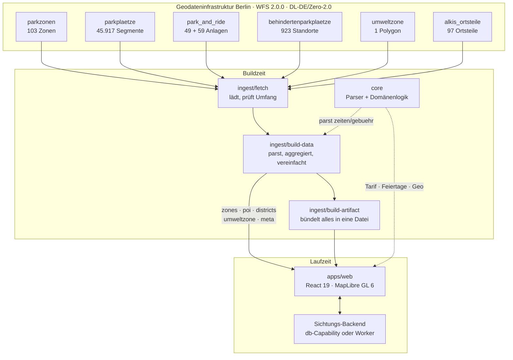
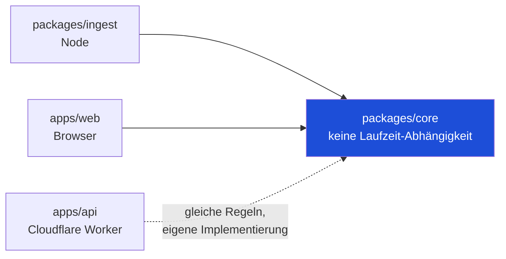
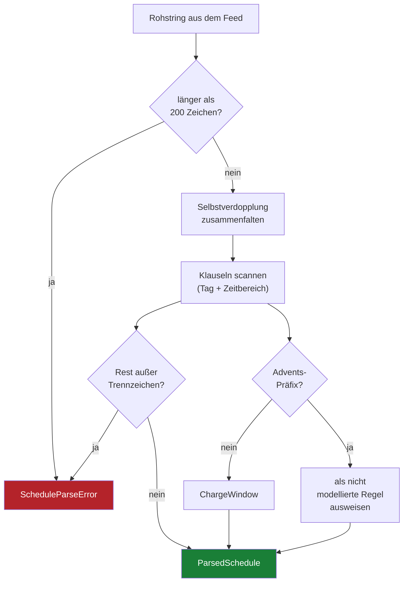
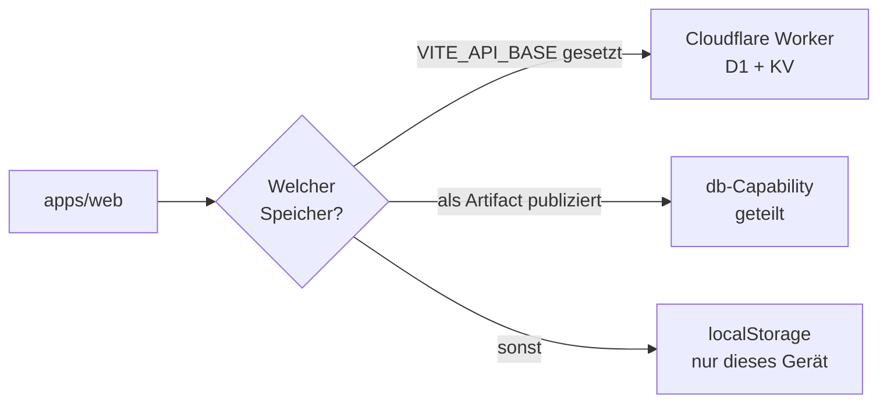
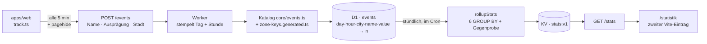

# Architektur

## Überblick



Die dicke Trennlinie liegt zwischen Build- und Laufzeit. Alles, was aus einer
fremden Quelle kommt, wird beim Bauen geprüft und eingefroren — nicht im Browser
des Nutzers.

**Das Bild zeigt Berlin als Beispiel, nicht als Sonderfall.** Hamburg,
Frankfurt am Main und München laufen durch dieselbe Form; nur die Kästen links
heißen anders, und jede Stadt hat ihren eigenen Parser, weil die vier Dienste
sich außer der Domäne nichts teilen — andere Felder, andere Schreibweisen,
andere Achsenreihenfolge. Welche Ebenen eine Stadt hat, steht in
`ingest/src/sources.ts`; was daraus wird, in
[data-sources.md](data-sources.md) und [staedte.md](staedte.md).

## Warum die Daten eingefroren werden

Der naheliegende Einwand: Warum nicht live abfragen? Vier Gründe, in dieser
Reihenfolge:

1. **Größe.** Der Segment-Layer ist ~49 MB. Was die App davon braucht — Kapazität
   und Höchstparkdauer je Zone — sind wenige Kilobyte Aggregat.
2. **Offline.** Eine Parkplatzsuche endet oft im Funkloch einer Tiefgarage.
3. **Reproduzierbarkeit.** Ein Build von heute lässt sich morgen identisch
   wiederholen.
4. **Rücksicht.** Jede Live-Abfrage trifft die Infrastruktur einer Behörde.

**Nicht** der Grund ist CORS: `gdi.berlin.de` sendet
`Access-Control-Allow-Origin: *`. Eine frühere Fassung dieser Datei behauptete
das Gegenteil; die Messung widerlegt es.

Die Daten altern langsam. Zonengrenzen und Tarife ändern sich über Monate — die
neuen Zonen 58 und 68 in Friedrichshain-Kreuzberg brauchten ein ganzes Frühjahr.
Ein nächtlicher Rebuild ist frischer als die Quelle sich bewegt.

## Paketgrenzen



`core` kennt weder React noch Node noch MapLibre. Das ist keine Ästhetik: Die
Tarifberechnung ist der Teil, bei dem ein Fehler den Nutzer Geld kostet, und sie
soll ohne Browser prüfbar sein — 570 Unit-Tests laufen in rund einer Sekunde.

Ein späterer nativer Client wäre ein zusätzliches Frontend gegen dasselbe `core`,
kein Rewrite.

## Der schwierige Teil: halbstrukturierte Quelldaten

Der Feed liefert Zeiten und Gebühren als **Freitext**. 28 verschiedene
Schreibweisen über beide Berliner Dienste für rund zehn tatsächliche Fahrpläne:

```
Mo-Fr 9-20 Uhr / Sa 9-18 Uhr      Mo-Fr 09:00-20:00 Uhr, Sa 09:00-18:00 Uhr
Mo-Sa, 9-22 Uhr                   Mo-Sa / 9-20 Uhr
Mo-Fr 9-20 / Sa 9-18 Uhr          Mo-Sa 9-22 UhrMo-Sa 9-22 Uhr
Mo-Fr 9-17 Uhr, Sa 9 -14 Uhr/ Advents-Sa 9 -17 Uhr
```

Der zentrale Fallstrick: **`/` und `,` sind überladen.** In
`Mo-Fr 9-20 Uhr / Sa 9-18 Uhr` trennen sie zwei Klauseln, in `Mo-Sa / 9-20 Uhr`
trennen sie Tagesangabe und Uhrzeit derselben Klausel. Ein Split am Trennzeichen
zerstört vier Zonen. Der Parser sucht deshalb nach vollständigen
Tag-plus-Zeit-Klauseln und behandelt jeden Rest als Fehler.



Ein Fehler bricht den **Datenbuild** ab, nicht erst die Laufzeit. Eine still
falsch geparste Zone würde jemandem einen Preis nennen, für den er ein Knöllchen
bekommt.

## Was bewusst nicht berechnet wird

| Fall | Warum nicht | Was die App stattdessen tut |
| --- | --- | --- |
| `Advents-Sa` (Zonen 10–13) | Die Quelle definiert nicht, welche Samstage gemeint sind | Status „unsicher", Hinweis auf den Automaten |
| Gebührenspanne `2,00-3,00 Euro` | Kein Wert ist für die ganze Zone richtig | Zeigt die Spanne, nie einen Mittelwert |
| Höchstparkdauer | Auf 1–2 % der Abschnitte gesetzt, nicht zonenweit | Nennt den Wert samt tatsächlicher Abdeckung |
| Bewohnerparkausweis | Nicht in den Daten | Sagt, dass der Preis für Besucher gilt |

Der gemeinsame Nenner: Lieber eine Lücke benennen als sie plausibel füllen.

## Zeitrechnung

Parkregeln stehen in lokaler Wanduhrzeit („Mo–Sa 9–20"). Berlin hat Sommerzeit,
also ist ein UTC-Vergleich ein halbes Jahr lang falsch. Die Umrechnung läuft über
`Intl.DateTimeFormat` mit `timeZone: 'Europe/Berlin'` — ohne Datumsbibliothek,
weil Temporal auf Node 22 noch nicht stabil ist.

Feiertage sind kein Detail: **Ein Werktagsfeiertag zählt wie Sonntag,
gebührenfrei.** Ohne diese Regel sagt die App am Karfreitag „zahlen". Bewegliche
Feiertage kommen aus dem Gregorianischen Osteralgorithmus; die feste Liste
enthält den 8. März (Berliner Besonderheit) und **nicht** Reformationstag oder
Buß- und Bettag.

Eine Zone widerlegt die naheliegende Vereinfachung: **Zone 29 in Mitte ist
`Mo-So 9-24 Uhr`** und kassiert sonntags. Eine pauschale Sonntagsregel meldete
dort „gebührenfrei" und schätzte 0 € für einen Aufenthalt, der 4 €/h kostet.

## Sichtungen

Nach dem Vorbild von blitzer.de, nicht von FreiFahren: Meldungen landen auf
freien Koordinaten, nicht auf Knoten eines Liniennetzes. Es gibt also keine Linie,
auf die man eine Bewegungsrichtung projizieren könnte — die Bestätigung durch
andere ist das einzige verfügbare Signal.

```
Konfidenz = Zustimmungsverhältnis × Zeitverfall

  Zustimmung = (Bestätigungen + 1) / (Bestätigungen + Widersprüche + 2)
  Verfall    = 0,5 ^ (Alter / 30 min)
  Cutoff     = 90 min, danach hart 0
```

Die Laplace-Glättung ist der Punkt: Eine frische Meldung ohne Rückmeldung landet
bei 0,5 — ein Vielleicht, keine Tatsache. Der Schwellwert für „bestätigt" liegt
bei 0,62, nicht 0,6: Der häufige Fall „zwei bestätigen, einer widerspricht"
ergibt exakt 3/5, und ein Schwellwert genau auf einem häufigen Wert entscheidet
echte Meldungen per Float-Vergleich.

**Zwei Fragen, zwei Zahlen — seit dem 9. September.** Ob eine Sichtung noch
*gilt*, entscheidet die Konfidenz mit Verfall: Unter 0,25 ist sie weg, die
Sterne zeigen ihr Alter. Ob sie *bestätigt* ist, entscheidet die Zustimmung
**allein**, ohne Verfall. Vorher hing beides am verfallenen Wert, und damit gab
es „bestätigt" praktisch nicht: Eine saubere Bestätigung hielt den Status drei
Minuten, zwei hielten ihn acht, drei Bestätigungen standen nach 27 Minuten bei
0,43 als „unbestätigt". Der Betreiber sah drei eigene Stimmen und fragte, ob die
noch eine extra Bestätigung brauchen — sie hätten nie gereicht.

## Zwei Datensätze für zwei Fragen

„Steht gerade jemand da?" und „wo wird oft kontrolliert?" sehen verwandt aus und
brauchen gegensätzliche Aufbewahrung. Statt die Sichtungen länger zu halten,
schreibt eine Meldung eine zweite, gröbere Zeile:

```
Meldung ──┬─► Sichtung   {lon, lat, Zeit, Zähler}   ~10 m · 5 min · 90 Minuten
          └─► Strichliste {Tag, Zelle}              250 m · Tag  · 28 Tage
```

Die Strichliste trägt keine ID der Sichtung und keinen Client-Hash — sie lässt
sich nicht zurückverfolgen, und zwei Striche desselben Tages sind untereinander
nicht verknüpfbar. Was entsteht, ist ein Histogramm, kein Weg.

Das Raster ist metrisch und hat einen **festen Ursprung**: ein aus den Daten
abgeleiteter Ursprung würde dieselbe Straße nach jedem Deploy in eine andere
Zelle legen. Aus demselben Grund ist die Rasterfunktion die einzige Regel, die
der Worker aus `core` importiert statt sie nachzubauen — eine um einen Meter
abweichende zweite Implementierung würde vier Wochen Striche still auf
Nachbarzellen streuen.

Zwei Dinge zeigt die Ebene bewusst nicht: Sie bleibt leer, solange weniger als
zwölf Meldungen im Fenster liegen — eine Heatmap aus vier Punkten sieht nach
Wissen aus und ist Rauschen. Und sie färbt **relativ** zur meistgemeldeten
Stelle, nie absolut: ohne bekannte Nutzerzahl sagt eine absolute Häufigkeit
nichts.

Der Radius ist in Bildschirmpunkten angegeben, nicht in Metern. Der erste Versuch
zeichnete die echten 250 m — bei Stadtzoom unter drei Pixel, also eine unsichtbare
Ebene. Die Zahlen, die die Farbe nicht tragen kann, stehen im Panel daneben.

## Backends



Drei Möglichkeiten, eine Schnittstelle (`subscribe` / `report` / `vote`). Die
Oberfläche sagt, welche gerade gilt — „Geteilt" oder „Nur auf diesem Gerät" —
statt geteilten Zustand vorzutäuschen, den es nicht gibt.

Eine frühere Fassung presste die REST-Variante in die Form des Dokumentspeichers
und verlor dabei die Richtung einer Stimme: Jedes „weg" wurde als „gesehen"
gesendet.

## Nutzungsstatistik: ein Zählwerk, kein Protokoll

Seit dem 8. September zählt die App mit, **was** benutzt wird — und zwar so
gebaut, dass daraus kein Verlauf werden kann.



Vier Entscheidungen tragen das Ganze, und jede hat einen Grund, den man beim
Lesen des Codes sonst raten müsste:

1. **Ort oder Zeit, nie beides.** Ereignisse, deren Ausprägung ein Ort ist
   (`zone.open`, `city.switch`), bekommen `hour = -1`; alle anderen bekommen
   die Stunde. Eine Zeile mit Ort *und* Uhrzeit wäre bei kleinen Zahlen ein
   Einzelereignis — und sie stünde neben `sightings` und `marks` in derselben
   Datenbank. `hourFor` in `core/events.ts` entscheidet das, nicht der Aufrufer.
2. **Der Server stempelt.** Tag und Stunde kommen aus `Date.now()` im Worker.
   Ein Stempel vom Client wäre rückdatierbar — dieselbe Falle, gegen die
   `/visits` seine „stale day"-Regel hat.
3. **Der Katalog ist die Grenze.** Name und Ausprägung werden gegen
   `core/events.ts` geprüft, die Zonenkennung gegen `ZONE_KEYS[stadt]`. Die
   Prüfung im Client ist eine Bequemlichkeit; was zählt, ist die im Worker.
   Ohne den Katalog wäre `value` eine Freitextspalte mit 90 Tagen
   Aufbewahrung.
4. **Die k-Schwelle steht im SQL, nicht in der Anzeige.** Eine Zone unter fünf
   Aufrufen geht in eine Sammelzeile „andere". Was die Antwort nicht enthält,
   kann auch niemand auslesen — und `GET /stats` liegt bewusst *nicht* hinter
   dem Beta-Riegel, weil der vor der Auslieferung der Seite steht und nicht vor
   dem Worker.

Ausgewertet wird zweimal: **wie oft** (je Tag, Stunde, Stadt, Ereignisname) und
**was** — die Ausprägungen der Ereignisse, deren Werte aufgezählt sind. Ohne die
zweite Hälfte steht unter „Was benutzt wird" je Ereignis genau eine Zahl, und
`layer.on: 214` beantwortet die Frage „welche Ebenen werden benutzt" gerade
nicht. Welche Ereignisse dorthin dürfen, entscheidet eine **Positivliste** im
SQL, nicht eine Ausnahmeregel: `zone.open` und `city.switch` tragen Orte als
Wert und gehen durch die k-Schwelle, nicht hier. Eine Positivliste kann nicht
dadurch undicht werden, dass jemand dem Katalog ein Ereignis hinzufügt.

Was **nicht** gespeichert wird: keine Kennung, keine Sitzung, keine Reihenfolge,
keine IP — auch nicht gehasht. Der Puffer im Browser liegt im Arbeitsspeicher
und nicht in `localStorage`, weil er dort ein Sitzungsverlauf auf fremdem Gerät
wäre. Der Preis sind ein paar verlorene Zählungen; der Gegenwert ist, dass die
Nicht-Liste stimmt. Ausschalten geht in den Einstellungen, und ein Gerät mit
`navigator.globalPrivacyControl` wird von vornherein nicht gezählt.

**Die Gegenprobe** ist die einzige Zahl auf der Statistikseite, die etwas über
die Seite selbst sagt: `visits` zählt Geräte je Tag über einen ganz anderen
Schreibweg, und jedes Gerät mit einer Besuchszeile hat die App geöffnet — also
muss `app.open` mindestens so groß sein. Ist es das nicht, kommen Bündel nicht
an, und das sähe sonst aus wie weniger Nutzung. Sie reicht nur zwei Tage weit,
weil `visits` nach zwei Tagen gelöscht wird und `events` nach 90.

**Der Aufräumlauf** (`scheduled`, stündlich zur Minute 7) hält alle Fristen
ein. Seit dem 8. September läuft jeder seiner elf Schritte für sich: Vorher war
es eine Kette aus `await`, und eine gescheiterte Auswertung hielt die
Löschungen dahinter an — eine Statistik, die nicht rechnen kann, verhinderte
damit die Einhaltung einer Zusage aus [datenschutz.md](datenschutz.md). Was
scheitert, wird am Ende geworfen; ein stiller `catch` wäre die schlechtere
Hälfte der Korrektur.

## Drei Fehler, die nur im echten Build auftreten

Alle drei wurden durch das Ausführen der gebauten App gefunden, nicht beim
Lesen des Codes — und der dritte hat am längsten gebraucht:

**MapLibre 6 lag gar nicht im Bündel.** Die Bibliothek startet zur Laufzeit
einen Worker aus einer eigenen Datei und setzt dessen Adresse selbst zusammen:
`new URL('./maplibre-gl-worker.mjs', import.meta.url)`. Der Dateiname steht
dabei in einer Variablen — kein Bundler kann ihn statisch erkennen, rolldown
legte die Datei also nicht ab, und die Anfrage lief in die SPA-Rückfalladresse.
Zurück kam **`index.html` mit `200 OK` und `text/html`**: kein 404, kein
`error`-Ereignis, keine Konsolenmeldung. Ohne Worker parst MapLibre weder
Vektorkacheln noch GeoJSON — die Karte hat deshalb **nie** etwas gezeichnet,
auch die Parkzonen nicht. Sichtbar war davon nur, dass `withMapReady` jedes Mal
in seinen 10-Sekunden-Rückfall lief. Behoben mit `setWorkerUrl` und einer
Adresse aus `?worker&url`.

**Der Kartencontainer hatte Höhe 0.** `maplibre-gl.css` setzt
`.maplibregl-map { position: relative }` bei gleicher Spezifität wie die eigene
Regel und wurde danach importiert — es gewann auf Reihenfolge.

**MapLibre wandelt verschachtelte GeoJSON-Properties in Strings.** Ein Klick
las `windows` als Array, bekam Text, und ohne Error Boundary riss das die ganze
App mit. Die geparste Zone lag die ganze Zeit im Speicher; der Klick schlägt sie
jetzt per ID nach.

## Herkunft

Das Repository begann 2012 als Java/Spring-Anwendung. Sie ist beim Umzug am
6. September 2026 **nicht mitgekommen** und liegt weiter im alten Repository
`herbeus/parkingzone`; ein Verzeichnis `ParkingZone/` gibt es hier nicht mehr
(Audit-Punkt M-027). Der Grund steht in CLAUDE.md: In den Commits von 2012
steht ein Passwort, und die Historie wird nicht umgeschrieben, sondern
zurückgelassen. Zwei Befunde aus dem Altcode haben
den Neubau geprägt:

Die Zonendaten waren **von Hand gezeichnet** — der Commit heißt wörtlich
`ParkZonen invented`, mit Polygonen namens „Schwierige Parkplatzsituation".

Koordinaten waren **durchgängig vertauscht**: `new Coordinate(lat, lng)` erwartet
in JTS `(x=lon, y=lat)`, und das Importskript drehte jeden Punkt beim Einlesen
ein zweites Mal. Zwei Fehler, die sich aufhoben. Ein Test in `geo-real.test.ts`
prüft heute explizit, dass vertauschte Koordinaten **nichts** finden.
